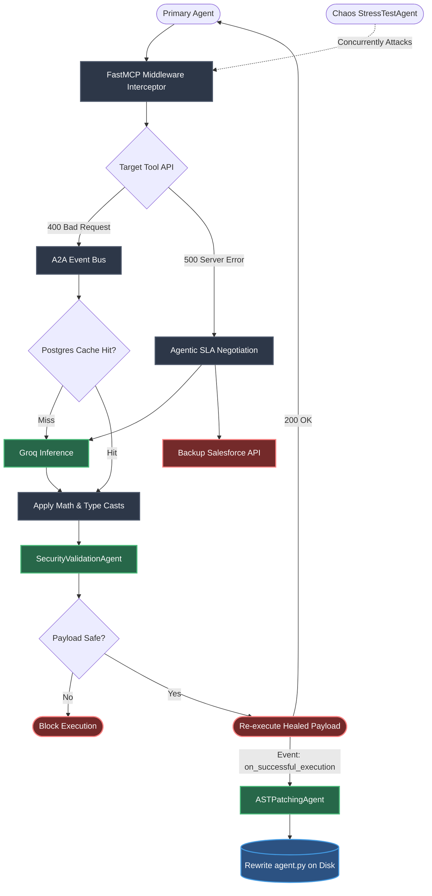

#  AutoHeal MCP Proxy (Agent-to-Agent Architecture)

An enterprise-grade, **Zero-Infrastructure Multi-Agent System** that intercepts API schema drift, dynamically infers mathematical payload transformations using a local LLM, and self-heals broken agents by rewriting their source code in real-time.

---

##  Core Features

- **The Event Bus Orchestrator**: The central engine runs on an asynchronous Event Bus. It doesn't hardcode logic. It catches 400 Bad Request errors, heals payloads, and broadcasts events (`on_schema_drift`, `on_successful_execution`).
- **Plug-and-Play A2A (Agent-to-Agent)**: You can drop new autonomous sub-agents into the ecosystem. They subscribe to events and run concurrently without shutting down the main proxy.
- **Deep Payload Transformations**: Uses strict Pydantic v2 schemas to force the LLM to output mapping rules including `key_mapping`, `value_cast` (e.g., `int`), and `value_math_modifier` (e.g., `* 100`).
- **Agentic SLA Negotiation**: Traps unrecoverable 500 Internal Server Errors, autonomously selects a backup competitor API, translates the JSON payload, and reroutes traffic on the fly for 100% uptime.
- **Enterprise Postgres Cache**: Uses a persistent PostgreSQL database (`asyncpg`) to store AI-generated schema fixes permanently, bypassing the LLM on future executions for 0ms latency.

##  The Agent Lineup

1. ** The SecurityValidationAgent (Zero-Trust Security)**
   Intercepts the LLM's generated payload before it touches the target API. Scans for malicious injections (like SQL drops) and blocks unsafe executions.
2. ** The ASTPatchingAgent (AST Auto-Patching)**
   Once a payload is successfully healed and executed, this agent wakes up in the background, locates the original agent's source code on your hard drive, and literally rewrites the python file so the agent never makes the mistake again.
3. ** The StressTestAgent (Chaos Engineering)**
   A stress-testing adversary agent. It bombards the FastMCP server with legacy schemas, weird data types, and broken JSON concurrently to visually demonstrate the AutoHeal proxy's locking resilience in live demos.

---

##  Enterprise Folder Structure

```text
autoheal-proxy/
├── pyproject.toml                  # uv dependencies (fastapi, pydantic)
├── main.py                         # FastAPI Control Plane Server
│
├── src/                            # Core Engine
│   ├── orchestrator/engine.py      # The A2A Event Bus & Proxy Engine
│   ├── transport/interceptor.py    # FastMCP Middleware interceptor hook
│   ├── data/cache.py               # Enterprise PostgreSQL Cache
│   ├── ai/
│   │   ├── schemas.py              # Strict Pydantic Models for deep transforms
│   │   └── inference.py            # High-speed Groq LLM integration
│   │
│   └── agents/                     # Plug-and-Play Sub-Agents
│       ├── base.py                 # Event-driven Base Agent
│       ├── security_validator.py   # Zero-Trust Security Agent
│       └── ast_patcher.py          # AST Auto-Patching Agent
│
└── demo/
    ├── mock_targets/crm_tool.py    # Target Tool with intentional schema drift
    └── agents/stress_test.py       # Chaos Engineering Attacker
```

---

##  The Neural Architecture (How it Works)



---

##  Getting Started (Live Demo)

1. **Install Dependencies**
   ```bash
   pip install fastapi uvicorn pydantic
   ```

2. **Start the Control Plane Server**
   ```bash
   python main.py
   ```

3. **Run the Demos via Swagger UI**
   - Open your browser to: `http://localhost:8000/docs`
   - Click `POST /api/run_agent` -> **Try it out** -> **Execute**. (Watch your terminal as the ASTPatchingAgent literally rewrites your files!)
   - Click `POST /api/run_stress_test` -> **Try it out** -> **Execute**. (Watch the Chaos Engineering attack get blocked by the `asyncio.Lock` cache).
