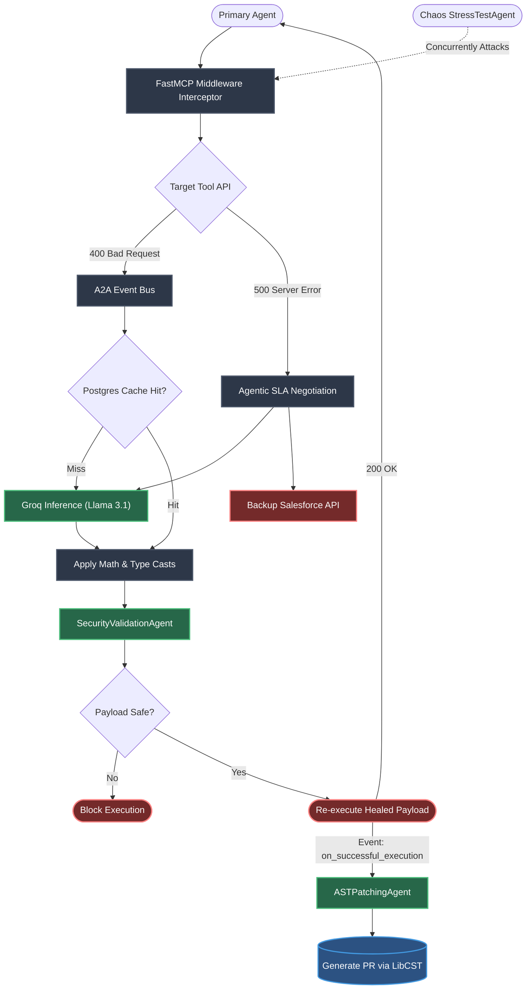

# 🛡️ AutoHeal MCP Proxy (Agent-to-Agent Architecture)

An enterprise-grade, **Zero-Infrastructure Multi-Agent System** that intercepts API schema drift, dynamically infers mathematical payload transformations using Groq (Llama 3.1), and generates Human-in-the-Loop GitHub Pull Requests to permanently patch agent source code via LibCST.

---

## 🚀 Core Features

- **The Event Bus Orchestrator**: The central engine runs on an asynchronous Event Bus. It doesn't hardcode logic. It catches 400 Bad Request errors, heals payloads, and broadcasts events (`on_schema_drift`, `on_successful_execution`).
- **Plug-and-Play A2A (Agent-to-Agent)**: You can drop new autonomous sub-agents into the ecosystem. They subscribe to events and run concurrently without shutting down the main proxy.
- **Agentic SLA Negotiation**: Traps unrecoverable 500 Internal Server Errors, autonomously selects a backup competitor API, translates the JSON payload, and reroutes traffic on the fly for 100% uptime.
- **Enterprise Postgres Cache**: Uses a persistent PostgreSQL database (`asyncpg`) to store AI-generated schema fixes permanently, bypassing the LLM on future executions for 0ms latency.
- **Lossless AST Patching**: Uses Meta's `LibCST` to parse Python Syntax Trees in memory, surgically replacing broken code without destroying developer comments or formatting.

## 🤖 The Agent Lineup

1. **🛡️ The SecurityValidationAgent (Zero-Trust Security)**
   Intercepts the LLM's generated payload before it touches the target API. Scans for malicious injections (like SQL drops) and blocks unsafe executions.
2. **🔧 The ASTPatchingAgent (Human-in-the-Loop)**
   Once a payload is successfully healed and executed, this agent wakes up, parses the original python script using LibCST, losslessly swaps the broken schema keys, and generates an industry-standard `.diff` GitHub Pull Request patch for human review.
3. **💥 The StressTestAgent (Chaos Engineering)**
   A stress-testing adversary agent. It bombards the FastMCP server with legacy schemas concurrently to visually demonstrate the AutoHeal proxy's locking resilience (`asyncio.Lock`) in live demos.

---

## 🕸️ The Neural Architecture (How it Works)



---

## 📁 Enterprise Folder Structure

```text
autoheal-proxy/
├── pyproject.toml                  # uv dependencies (fastapi, pydantic, libcst)
├── main.py                         # FastAPI Control Plane Server
│
├── engine/                         # Core Engine
│   ├── engine.py                   # The A2A Event Bus & Proxy Engine
│   ├── interceptor.py              # FastMCP Middleware interceptor hook
│   ├── cache.py                    # Enterprise PostgreSQL Cache
│   ├── schemas.py                  # Strict Pydantic Models for deep transforms
│   ├── inference.py                # High-speed Groq Cloud LLM integration (Llama 3.1)
│   │
│   └── plugins/                    # Plug-and-Play Sub-Agents
│       ├── base.py                 # Event-driven Base Agent
│       ├── security_validator.py   # Zero-Trust Security Agent
│       └── ast_patcher.py          # LibCST Human-in-the-Loop PR Agent
│
└── demo/
    ├── mock_targets/crm_tool.py    # Target Tool with intentional schema drift
    └── agents/stress_test.py       # Chaos Engineering Attacker
```

---

## 🏁 Getting Started (Live Demo)

1. **Install Dependencies (Using uv)**
   ```bash
   uv sync
   ```

2. **Start the Control Plane Server**
   ```bash
   uv run python main.py
   ```

3. **Start the React Telemetry Dashboard**
   ```bash
   cd web
   npm run dev
   ```
