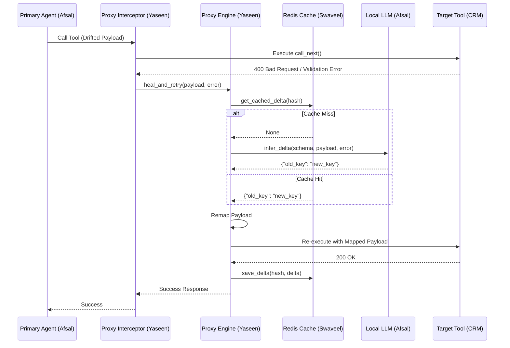

# AutoHeal MCP Proxy - Architecture Design

## System Overview
The AutoHeal MCP Proxy is designed to decouple tool execution failure states from the primary AI agent. It acts as a FastMCP middleware interceptor that catches JSON-RPC validation exceptions (e.g., 400 Bad Request) indicating schema drift, and automatically self-heals the payload before the primary agent even notices a failure.

## Component Architecture

1. **Primary Agent**: The main reasoning engine trying to accomplish a workflow.
2. **FastMCP Server**: The host for the tools/APIs.
3. **AutoHeal Middleware (`interceptor.py`)**: Traps execution, catches validation errors, and passes the failed context to the orchestrator.
4. **Proxy Engine (`engine.py`)**: The central orchestrator for the self-healing workflow.
5. **Delta Cache (`cache.py`)**: A high-speed Redis key-value store mapping old payload hashes to successful payload deltas.
6. **Inference Fallback (`inference.py`)**: A fast, local LLM (e.g., Ollama running Llama 3.1 8B) tuned for structured JSON output to deduce schema mapping fixes.

## Request Lifecycle (Sequence Diagram)

