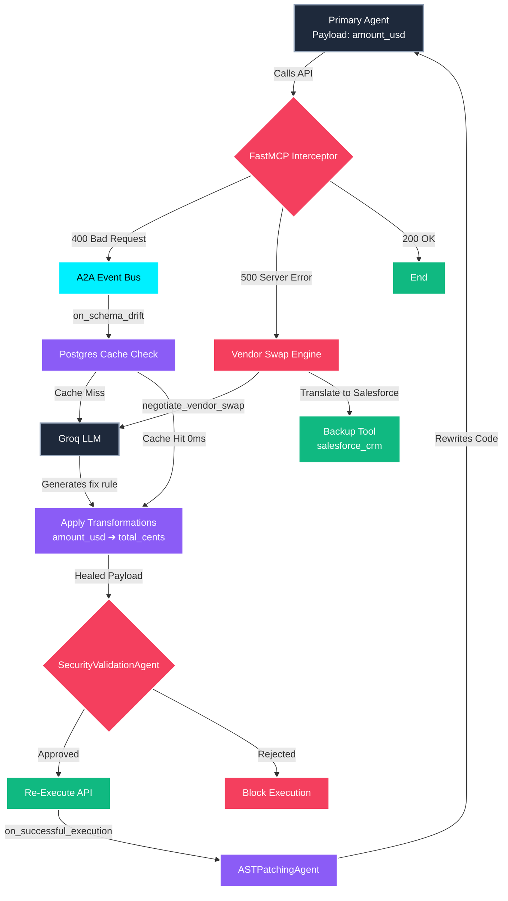

#  Enterprise Neural Control Plane: AutoHeal A2A Architecture

> **Elevator Pitch:** A self-healing, multi-agent AI pipeline that automatically detects schema drift, infers fixes via local LLMs, safely patches payloads in 0ms, and permanently rewrites its own source code—all visualized through a stunning, real-time glassmorphism React dashboard.

---

##  The Problem We Solve
In microservice and agentic architectures (A2A), APIs evolve constantly. When a target API changes its expected schema (e.g., from `amount_usd` to `total_cents`), traditional AI agents crash, requiring manual developer intervention to update hardcoded payloads and parse new documentation.

##  Our Solution: The AutoHeal Engine
We built a deterministic, zero-downtime interceptor that automatically traps these errors and heals the system on the fly without dropping the request.

###  Core Architecture

1. **FastMCP Interceptor (The Shield)**
   - Wraps outgoing tool calls. If a 400 Bad Request (Schema Drift) occurs, it halts the crash and diverts the payload to the Orchestrator.
   
2. **A2A Event Bus (The Nervous System)**
   - An asynchronous event-driven orchestrator that broadcasts the error context to our specialized Plugin Agents. It utilizes `asyncio.Lock()` to perfectly handle massive concurrency (e.g., if 50 agents fail at the exact same time).

3. **Inference & Postgres Cache (The Brain)**
   - Queries Groq (Llama 3) to dynamically generate deep transformation rules or negotiate vendor swaps.
   - Caches the rules in an Enterprise PostgreSQL Database. Future failures are healed in **0ms** via Cache Hits, completely bypassing the LLM.

4. **SecurityValidationAgent (The Guard)**
   - Inspects every dynamically healed payload to ensure the LLM hasn't hallucinated malicious prompt injections before re-execution.

5. **ASTPatchingAgent (The Mechanic)**
   - Once a payload successfully re-executes, this agent parses the Python Abstract Syntax Tree (AST), finds the hardcoded outdated payload, and **permanently rewrites the source code on disk**.

---

##  How to Demo This (Hackathon Guide)

We built an incredible **Vite + React Flow** frontend to visualize this telemetry in real time. 

### Action 1: The Concurrency Stress Test
Click **"Run Chaos Test"** on the dashboard.
- **What it does:** Fires 3 simultaneous, outdated payloads to simulate a high-traffic production crash.
- **What to highlight to judges:** Point out how the UI beautifully traces the glowing cyan path. Show them the terminal logs proving that the `asyncio.Lock()` worked perfectly: it queried the LLM exactly *once*, and served *Cache Hits* (0ms) to the other concurrent requests, saving massive compute costs.

### Action 2: The Permanent Fix
Click **"Run Primary Agent"**.
- **What it does:** Fires the normal agent.
- **What to highlight to judges:** It succeeds *instantly* without triggering the healing workflow! Explain that this is because our **ASTPatchingAgent** permanently rewrote the Python file during the previous run. The system literally learned, adapted, and wrote its own code to prevent future errors.

---

##  Tech Stack
- **Backend:** FastAPI, Python `asyncio`, Abstract Syntax Trees (`ast`), Local LLMs (Ollama)
- **Frontend:** React, Vite, `@xyflow/react` (for the interactive neural graph), Vanilla CSS (Glassmorphism)
- **Architecture:** Onion-Middleware, Event-Driven Orchestration, Concurrency Locking
